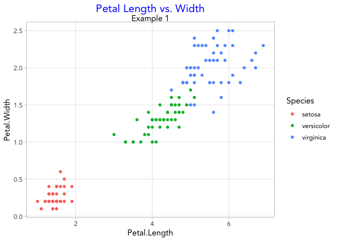
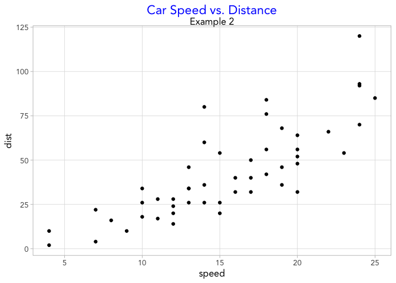

Code Chunk
================

This code chunk is a unique theme for plots and graphs in `R`. The code
is presented below with annotations along with example graphs showing
how the theme can be applied to use the same style on multiple graphs
easily.

This theme is based on the `ggplot` theme `theme_light` and removes the
background from both the plot and legend. Minor gridlines are removed to
reduce visual clutter. The title is modified to be centered in blue
text.

### Theme

``` r
theme_AMG=function(){ 
theme_light(base_size=12, base_family="Avenir") %+replace% #set consistent font
  theme(
    panel.background=element_blank(), #remove plot background
    legend.background=element_rect(fill="transparent", colour=NA), #legend background transparent
    legend.key=element_rect(fill="transparent", colour=NA),
    plot.title=element_text(color='blue', size="16", hjust=0.5, vjust=1), #center plot title, adjust appearance
    plot.subtitle=element_text(hjust=0.5),
    panel.grid.minor=element_blank())} #remove minor grid lines
```

### Examples

``` r
ggplot(iris, aes(x=Petal.Length, y=Petal.Width))+
  geom_point(aes(color=Species))+
  labs(title= 'Petal Length vs. Width', subtitle= 'Example 1')+
  theme_AMG()
```



``` r
ggplot(cars, aes(x=speed, y=dist))+
  geom_point()+
  labs(title= 'Car Speed vs. Distance', subtitle= 'Example 2')+
  theme_AMG()
```


